# System Diagrams (Mermaid)

> Các diagram trực quan của pipeline. Render bằng:
> - GitHub auto (nếu push lên GitHub)
> - VS Code: extension `Markdown Preview Mermaid Support`
> - Online: [mermaid.live](https://mermaid.live)
> - Tool nội bộ: `/ck:preview --diagram` (xem [mermaidjs-v11 skill](file:///$HOME/.claude/skills/mermaidjs-v11))

## 1. High-level Architecture

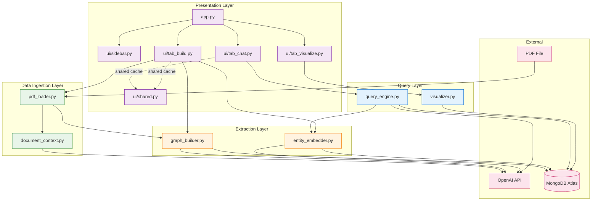

## 2. Phase 1: Build Graph (sequence diagram)

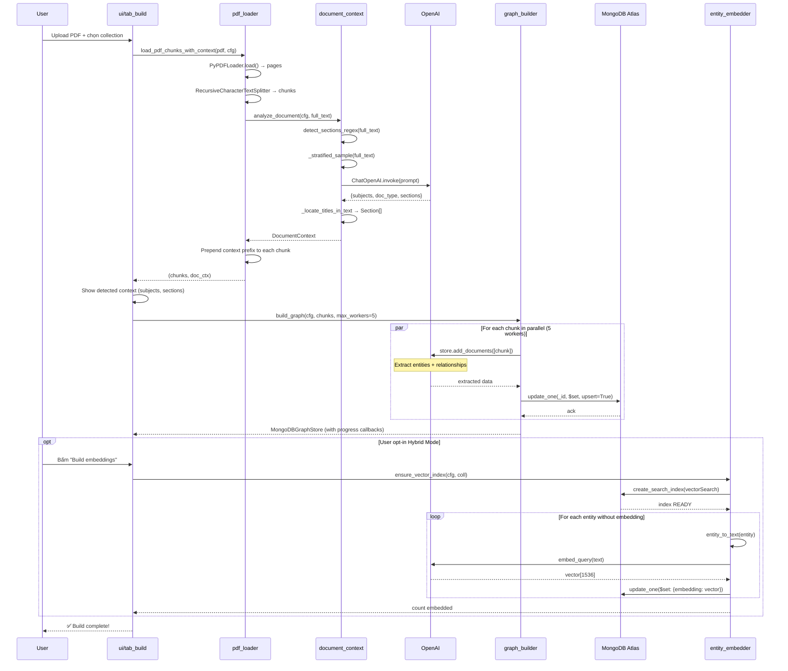

## 3. Phase 2: Query (sequence diagram)

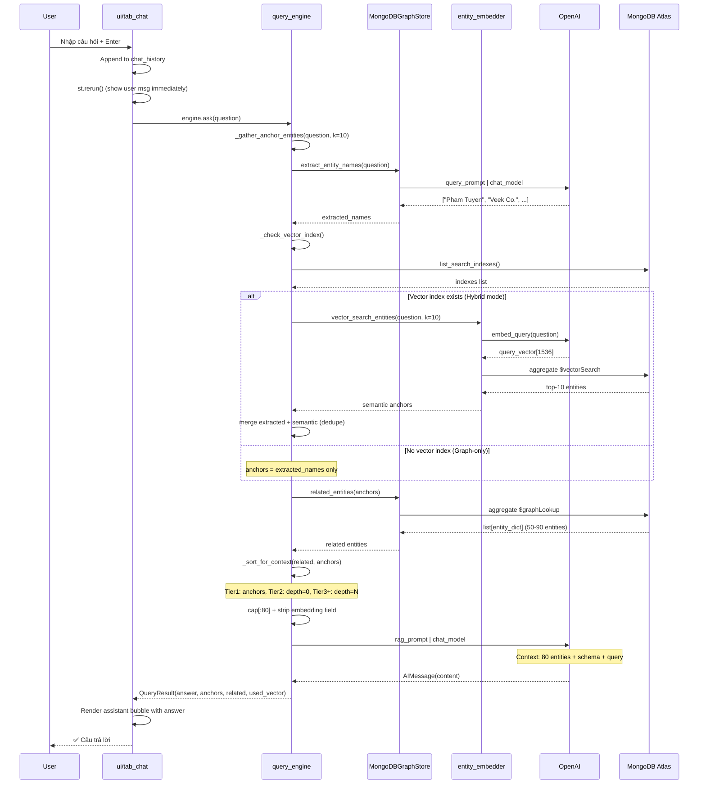

## 4. Phase 3: Visualize (sequence diagram)

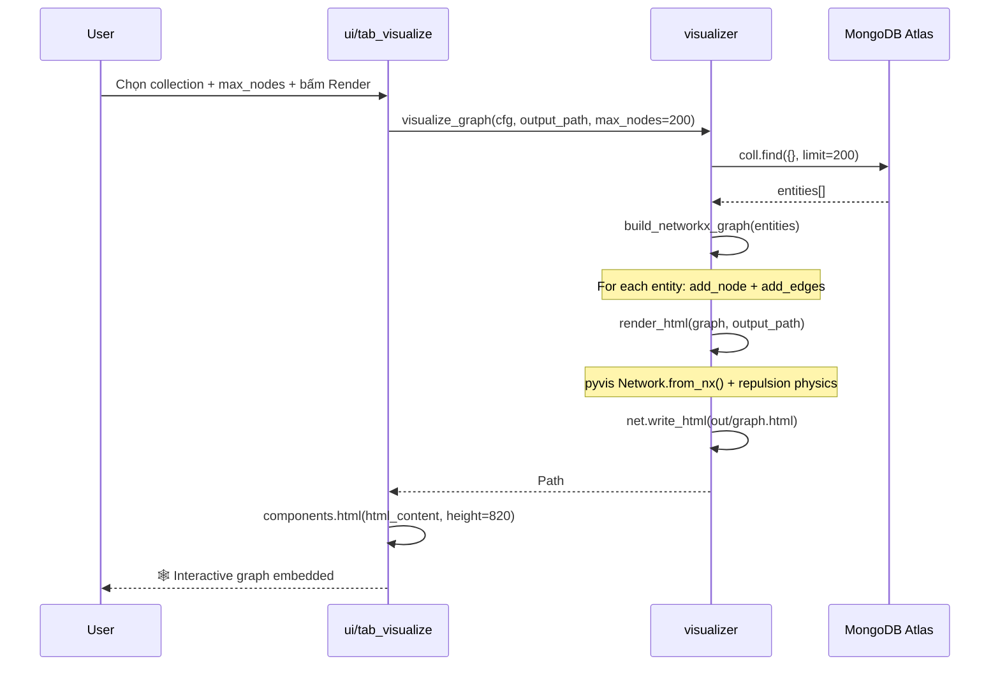

## 5. Data flow — Entity lifecycle

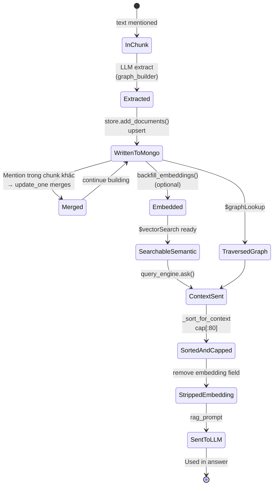

## 6. Component dependency graph

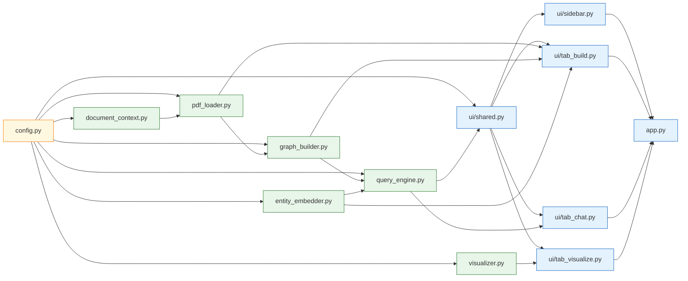

## 7. Retry mechanism (exponential backoff)

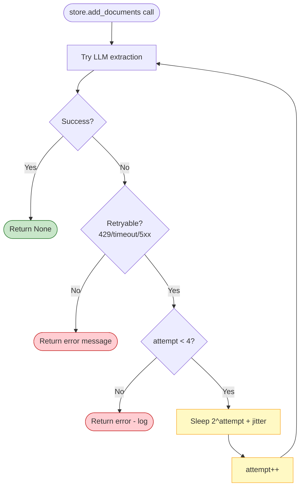

## 8. Hybrid retrieval decision tree

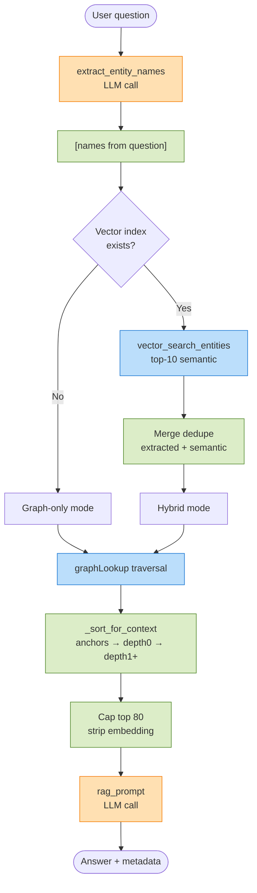

## 9. Context injection structure

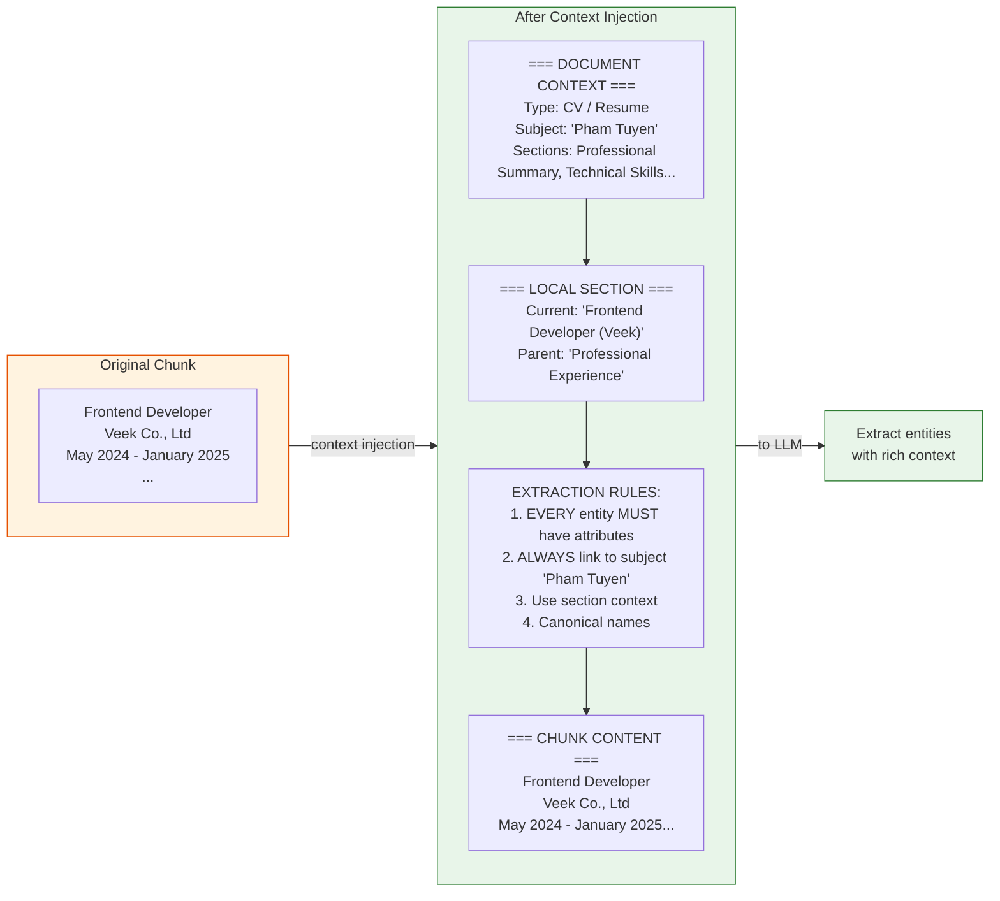

## 10. Entity schema in MongoDB

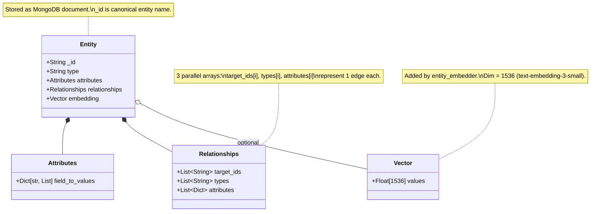

## 11. Streamlit UI state flow

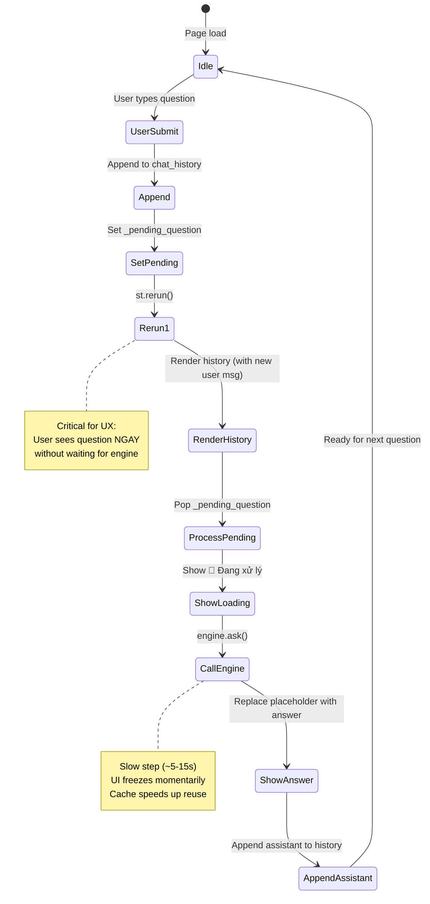

## 12. Build progress with parallel workers

```mermaid
gantt
    title Build với 5 workers song song (10 chunks)
    dateFormat X
    axisFormat %s

    section Worker 1
    Chunk 1     :w1c1, 0, 40s
    Chunk 6     :w1c2, after w1c1, 35s

    section Worker 2
    Chunk 2     :w2c1, 0, 45s
    Chunk 7     :w2c2, after w2c1, 40s

    section Worker 3
    Chunk 3     :w3c1, 0, 38s
    Chunk 8     :w3c2, after w3c1, 42s

    section Worker 4
    Chunk 4     :w4c1, 0, 50s
    Chunk 9     :w4c2, after w4c1, 35s

    section Worker 5
    Chunk 5     :w5c1, 0, 42s
    Chunk 10    :w5c2, after w5c1, 38s
```

Sequential build cùng workload sẽ là 400s (10 × 40s avg). Parallel chỉ ~85s.

## 13. RAG context assembly priority

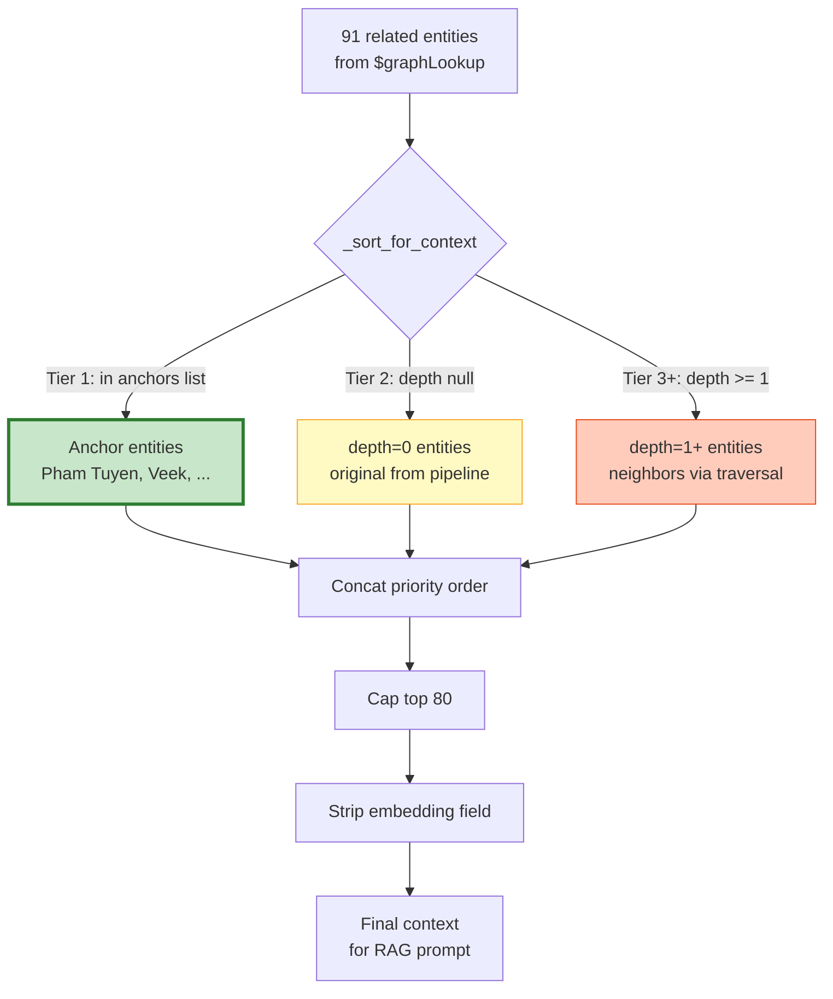

## 14. Document context detection workflow

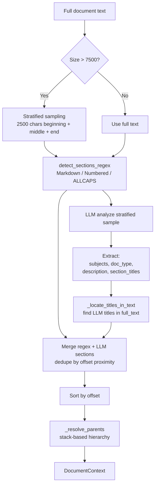

## Cách export diagrams

### Export PNG/SVG

1. Copy code mermaid khối nào đó
2. Paste vào [mermaid.live](https://mermaid.live)
3. Actions → Download SVG/PNG

### Render trong VS Code

1. Cài extension: "Markdown Preview Mermaid Support" (`bierner.markdown-mermaid`)
2. Open file `.md` → Cmd/Ctrl+Shift+V → preview

### Render trong terminal

```powershell
# Cài mermaid-cli
npm install -g @mermaid-js/mermaid-cli

# Render
mmdc -i docs/diagrams.md -o out/diagrams.png
```

### Render trong project tool

```powershell
# Dùng skill có sẵn /mermaidjs-v11
# Trong Claude Code: gõ /ck:preview --diagram
```

## 📚 Đọc thêm

- [Pipeline Overview](pipeline-overview.md) — text description của architecture
- [Component Relationships](component-relationships.md) — chi tiết phụ thuộc
- [Mermaid Docs](https://mermaid.js.org/intro/)
